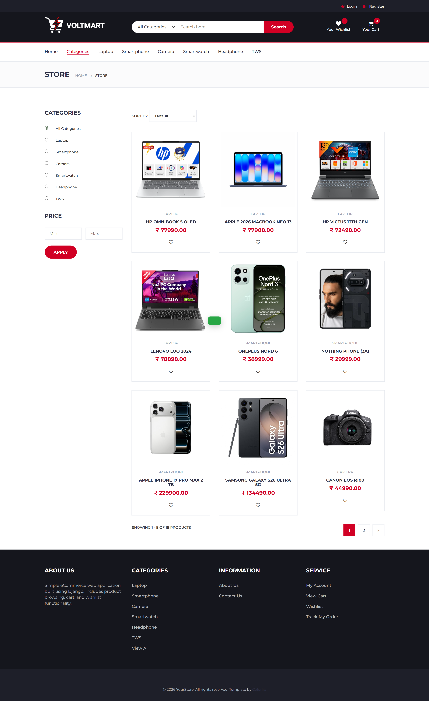
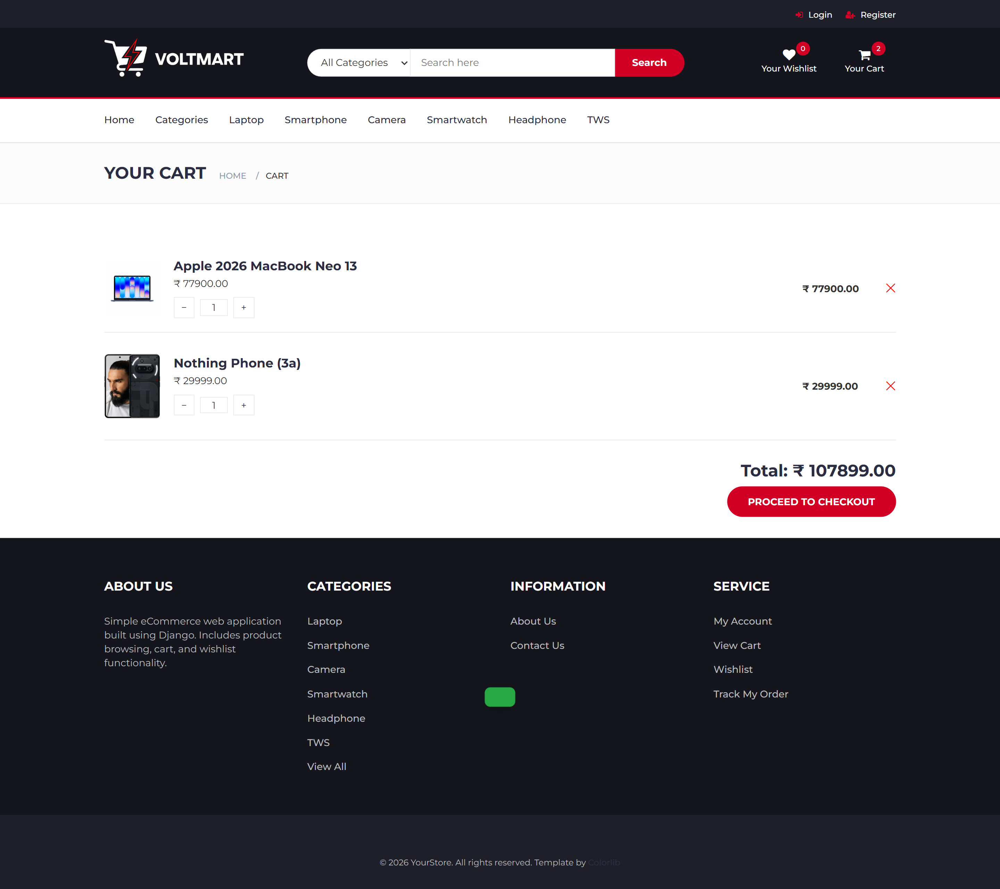
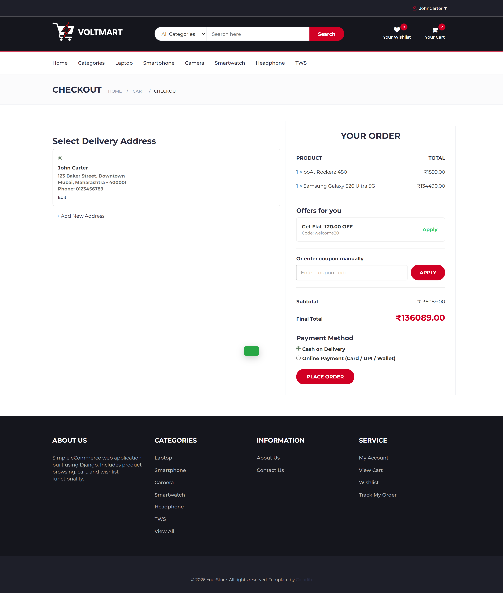
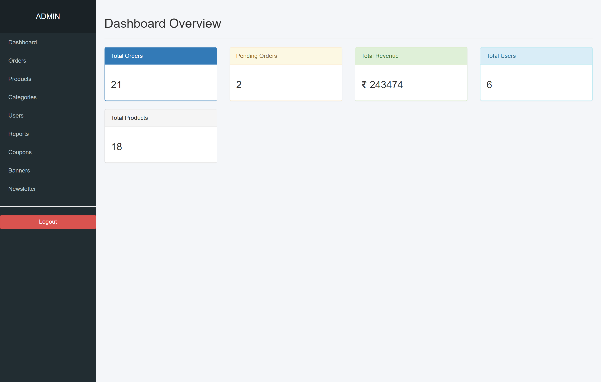

# ⚡ VoltMart — Full-Stack E-Commerce Platform


A fully functional e-commerce web application built with Django. VoltMart supports end-to-end shopping — from product browsing and cart management to checkout, payment processing, and order tracking — along with a custom admin dashboard for store management.

> 🎯 Built as a portfolio project to demonstrate full-stack Django development skills.

---

## 🚀 Live Features

### 🛍️ Shopping Experience
- Product catalog with category filtering, text search, price range filters, and sorting
- Custom pagination — all filters preserved across pages
- Product detail pages with image gallery (Slick Carousel)
- Wishlist — add/remove products dynamically via AJAX

### 🛒 Cart System
- **Dual-state cart:** Session-based for guests, database-backed for logged-in users
- Automatic cart merge when a guest logs in — no items lost
- Real-time cart item count update via AJAX

### 💳 Checkout & Payments
- Multiple saved shipping addresses per user
- Discount coupon system (percentage & fixed amount) with usage limits
- **Razorpay** payment gateway with webhook signature verification
- Cash on Delivery (COD) option
- Demo/simulate payment mode for portfolio demonstration
- Automatic refund trigger on order cancellation (when applicable)

### 👤 User Accounts
- Email-based registration with account verification (URL-safe base64 tokens)
- Login, logout, password reset flow
- Profile management and account deletion

### 🧑‍💼 Admin Dashboard (`/dashboard/`)
- Custom staff dashboard (separate from Django's default `/admin`)
- Full CRUD for: Products, Categories, Orders, Users, Coupons, Hero Banners, Newsletters
- Order status management (update, cancel, track)
- Ban / activate user accounts
- Sales reports and key performance metrics

---

## 🧰 Tech Stack

| Layer | Technology |
|---|---|
| Backend | Django 5.2 (Python) |
| Database | SQLite3 (development) |
| Frontend | HTML5, CSS3, Bootstrap 3, jQuery |
| UI Theme | Electro (E-Commerce Template) |
| Carousel | Slick Carousel |
| Payments | Razorpay |
| Auth | Django Auth + Custom Email Verification |
| Environment | python-dotenv |

---

## 📁 Project Structure

```
voltmart-ecommerce/
├── ecommerce/          # Project config (settings.py, urls.py)
├── accounts/           # User auth, profile, email verification
├── products/           # Catalog, categories, wishlist, banners
├── cart/               # Cart logic, session/db merge
├── orders/             # Checkout, addresses, coupons
├── payments/           # Razorpay integration, transaction models
├── dashboard/          # Custom admin panel
├── templates/          # HTML templates
│   ├── base.html       # Master layout
│   ├── components/     # Reusable components (product card, etc.)
│   └── dashboard/      # Admin templates
├── static/             # CSS, JS, fonts, images
├── media/              # User-uploaded images (gitignored)
├── .gitignore
├── manage.py
└── requirements.txt
```

---

## ⚙️ Local Setup

### 1. Clone the repository
```bash
git clone https://github.com/safwan-km/voltmart-ecommerce.git
cd voltmart-ecommerce
```

### 2. Create and activate virtual environment
```bash
python -m venv venv
# Windows
venv\Scripts\activate
# Mac/Linux
source venv/bin/activate
```

### 3. Install dependencies
```bash
pip install -r requirements.txt
```

### 4. Create your `.env` file
Create a `.env` file in the root directory with the following:
```env
SECRET_KEY=your_django_secret_key
DEBUG=True
RAZORPAY_KEY_ID=your_razorpay_key_id
RAZORPAY_KEY_SECRET=your_razorpay_key_secret
EMAIL_HOST_USER=your_email@gmail.com
EMAIL_HOST_PASSWORD=your_email_app_password
```

### 5. Run migrations
```bash
python manage.py migrate
```

### 6. Create a superuser
```bash
python manage.py createsuperuser
```

### 7. Run the development server
```bash
python manage.py runserver
```

Visit `http://127.0.0.1:8000/` in your browser.

---

## 📸 Screenshots







---

## 🔐 Environment Variables

| Variable | Description |
|---|---|
| `SECRET_KEY` | Django secret key |
| `DEBUG` | Set to `True` for development |
| `RAZORPAY_KEY_ID` | Razorpay API key |
| `RAZORPAY_KEY_SECRET` | Razorpay secret key |
| `EMAIL_HOST_USER` | Gmail address for sending emails |
| `EMAIL_HOST_PASSWORD` | Gmail App Password |

---

## 🗺️ Deployment Notes

This project is configured for local development. For production deployment the following are required:

- Switch from SQLite3 to **PostgreSQL** or **MySQL**
- Configure cloud media storage (**AWS S3** or **Cloudinary**) via `django-storages`
- Serve static files via **WhiteNoise**
- Use **Gunicorn** as the production WSGI server
- Set `DEBUG=False` and configure `ALLOWED_HOSTS`
- Enable HTTPS security settings (`SECURE_SSL_REDIRECT`, `SESSION_COOKIE_SECURE`, etc.)
- Switch to a professional email relay (**SendGrid**, **Mailjet**, or **Amazon SES**)

---

## 👨‍💻 Author

**Safwan KM**
[GitHub](https://github.com/safwan-km)

---

## 📄 License

This project is open source and available under the [MIT License](LICENSE).